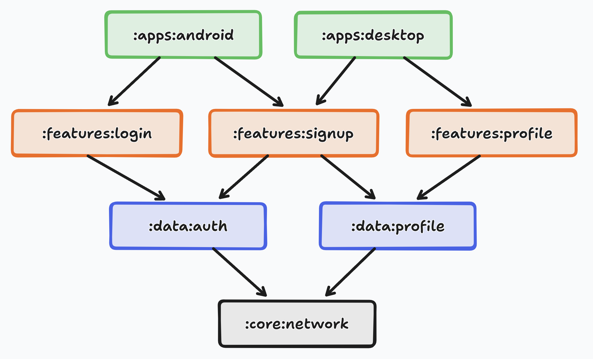
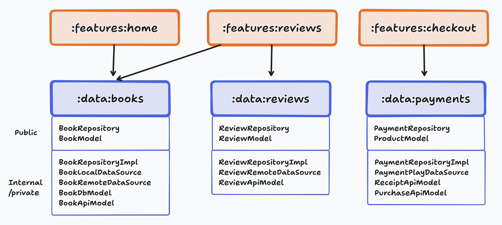
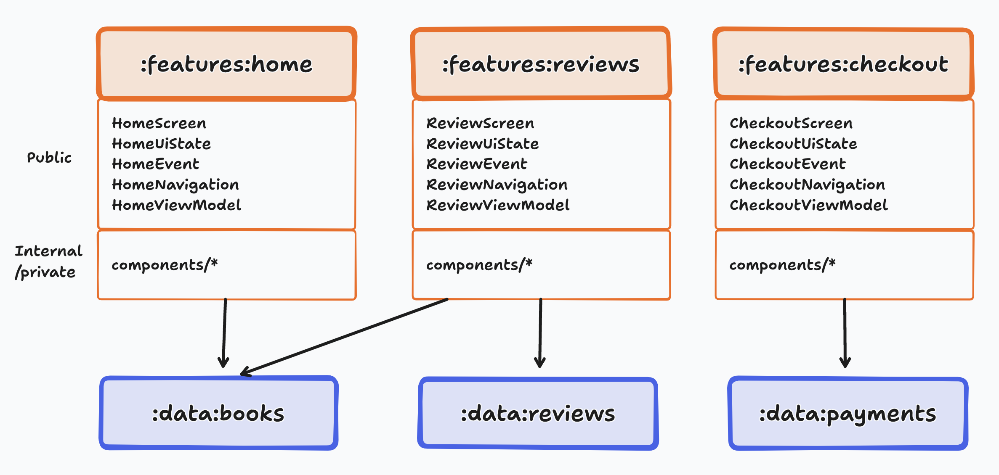
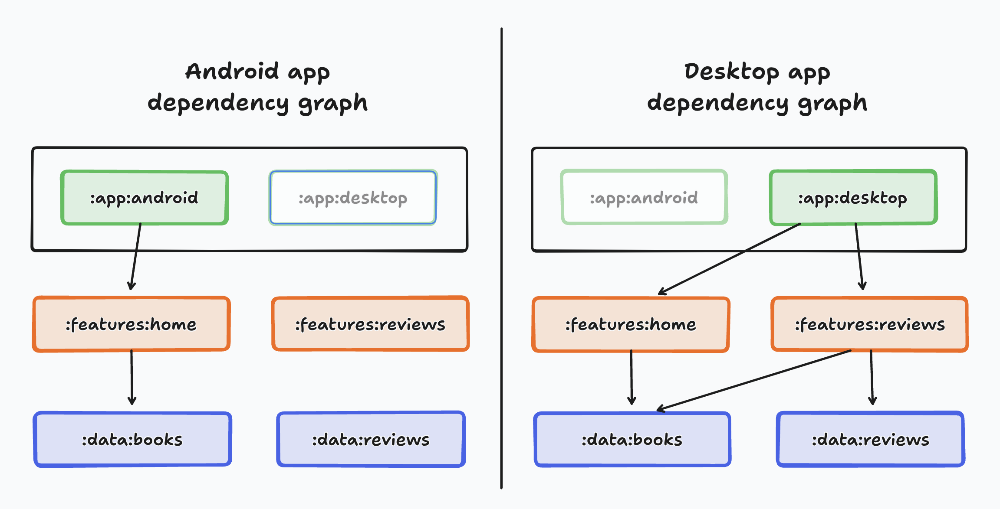

# Architecture Overview

The project follows the multi-module clean architecture with some modifications to fit the nature of the project.
Each feature is a module and has its own domain, data, and ui layers.

## The growing codebase problem

In an ever-growing codebase, scalability, readability, and overall code quality often decrease through time. This comes as a result of the codebase increasing in size without its maintainers taking active measures to enforce a structure that is easily maintainable. Modularization is a means of structuring your codebase in a way that improves maintainability and helps avoid these problems.

## What is modularization?

Modularization is a practice of organizing a codebase into loosely coupled and self-contained parts. Each part is a module. Each module is independent and serves a clear purpose. By dividing a problem into smaller and easier to solve subproblems, you reduce the complexity of designing and maintaining a large system.

**Figure 1**. Dependency graph of a sample multi-module codebase

## High cohesion and low-coupling principle

- **Low coupling** means that modules should be as independent as possible from one another, so that changes to one module have zero or minimal impact on other modules. **Modules shouldn't have knowledge of the inner workings of other modules**.
- **High cohesion** means that modules should comprise a collection of code that acts as a system. They should have clearly defined responsibilities and stay within the boundaries of certain domain knowledge. Consider a sample ebook application. It might be inappropriate to mix book and payment related code together in the same module as they are two different functional domains.
> **Tip:** If two modules heavily rely on knowledge of each other, it may be a good sign that they should actually act as one system. Conversely, if two parts of a module don’t interact with each other often, they should probably be separate modules.

## Types of modules

The way you organize your modules mainly depends on your app architecture.
Below are some common types of modules you could introduce in your app while following our recommended app architecture.

### Data modules

A data module usually contains a repository, data sources and model classes.
The three primary responsibilities of a data module are:

1. **Encapsulate all data and business logic of a certain domain**: Each data module should be responsible for handling data that represents a certain domain. It can handle many types of data as long as they are related.
2. **Expose the repository interface as an external API**: The public API of a data module should be a repository as they are responsible for exposing the data to the rest of the app.
3. **Hide all implementation details and data sources from the outside**: Data sources should only be accessible by repositories from the same module. They remain hidden to the outside. You can enforce this by using Kotlin’s private or internal visibility keyword.

**Figure 2**. Sample data modules and their content.

For creating a new data module, follow the [Create data module guide](../new-data-module/1-create-data-module.md)

### Feature modules

A feature is an isolated part of an app's functionality
that usually corresponds to a screen or series of closely related screens,
like a sign up or checkout flow.
If your app has a bottom bar navigation, it’s likely that each destination is a feature.

Features are associated with screens or destinations in your app.
Therefore, they're likely to have an associated UI and ViewModel to handle their logic and state.
A single feature doesn't have to be limited to a single view or navigation destination.
**Feature modules depend on data modules**.

**Figure 3**. Sample feature modules and their content.

For creating a new feature module, follow the [Create feature module guide](../new-feature-module/1-create-feature-module.md)

### App modules

App modules are an entry point to the application.
They depend on feature modules and usually provide root navigation.
A single app module can be compiled to a number of different binaries thanks to build variants.

**Figure 4**. **android** and **desktop** app modules dependency graph.

If your app targets multiple device types, such as android, iOS or desktop, define an app module per each.
This helps separate platform-specific dependencies.

### Core modules

Core modules contain code that other modules frequently use,
such as networking, dependency injection, and utility functions.
They reduce redundancy and don't represent any specific layer in an app's architecture

By default, we have the following core modules:
- `core:ui`: Contains UI code, such as the theme, the colors, the fonts, and the common UI components.
- `core:nerwork`: Contains networking code, such as HTTP clients and the error handling logic.
- `core:databse`: Contains database code, such as the database setup, the entities and the migrations.
- `core:util`: Contains utility code, such as date and time utilities, string utilities, and other general-purpose utilities.

### Test modules

Test modules are modules that are used for testing purposes only.
The modules contain test code, test resources, 
and test dependencies that are only required for running tests and are not needed during the application's runtime. 
Test modules are created to separate test-specific code from the main application,
making the module code easier to manage and maintain.

[Back to Home](../../README.md)